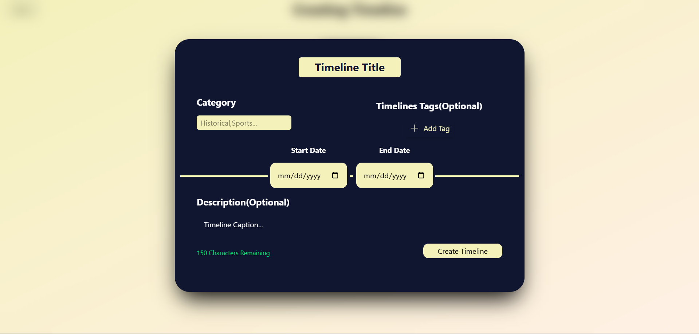
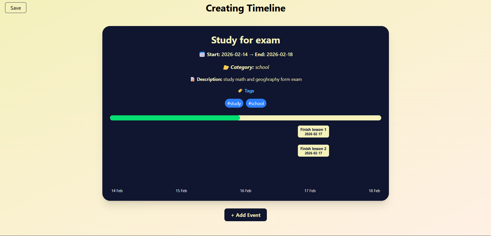

<div align="center">

# Linear Vanilla JS(Without any data storage or backend)

**Experience the Linear-style aesthetics, rebuilt with pure Vanilla JavaScript.**


</div>

<br />

## ✨ Overview

**Linear Vanilla JS** is a high-performance, pixel-perfect implementation of the Linear interface design patterns, built entirely without frameworks.

The goal of this project is to demonstrate how to achieve complex UI effects (like glow borders, dynamic cursors, and smooth animations) using only standard web technologies. No React, no Vue, just raw power.

---

## 📸 Preview

See the project in action:

<!-- REPLACE THE LINKS BELOW WITH YOUR ACTUAL SCREENSHOTS OR GIF PATHS -->

<div align="center"> 
  
</div>

<br/>

<div align="center">
  
  
</div>

---

## 🚀 Features

- **Zero Dependencies:** No bloat, no heavy bundles. Just pure JS.
- **High Performance:** Optimized for 60fps animations.
- **Linear Aesthetics:** Includes the signature glow effects and dark mode polish.
- **Responsive Design:** Looks great on desktops, tablets, and mobile devices.
- **Clean Architecture:** easy to read and modify codebase.

---

## 🛠️ Tech Stack

- **HTML5**: Semantic markup.
- **CSS3**: Flexbox, Grid, CSS Variables, and complex animations.
- **JavaScript (ES6+)**: DOM manipulation and interaction logic.

---

## ⚡ Getting Started

To get a local copy up and running, follow these simple steps.

### Prerequisites

You just need a modern web browser.

### Installation

1.  **Clone the repository**

    ```sh
    git clone https://github.com/daniHash/Linear-Vanilla-js.git
    ```

2.  **Navigate to the project directory**

    ```sh
    cd Linear-Vanilla-js
    ```

3.  **Open `index.html`**
    Simply open the `index.html` file in your browser, or use a live server extension (VS Code) for the best experience.

---

This project idea was inspired by [**Arya Veysi**](https://github.com/Arya-veysi)
